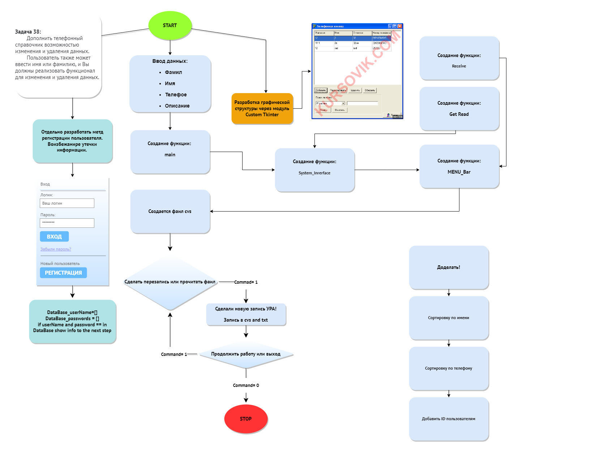

# Телефонная книга

### В версии 1.0.1 реолизованно

Конструкция try-except является механизмом обработки исключений в языке Python. Она позволяет перехватывать и обрабатывать ошибки, которые могут возникнуть в процессе выполнения программы.
Основной синтаксис try-except выглядит примерно так:

            try:
                    #операции, которые могут вызвать ошибку
            except:
                    #действия, которые необходимо выполнить в случае ошибки

Действия, которые находятся в блоке try, выполняются нормально, если ошибок не происходит. Если при выполнении операций в блоке try возникает ошибка.

> ### Исключения это то, что может непредвиденно возникнуть в ходе работы программы. Если такое случиться, то программа просто перестанет работать или же вовсе выключиться. Чтобы такого не допустить вам всегда стоит добавлять исключения при работе с различными вещами.

### В версии 1.0.2 реолизованно

Создание папки сохранения данных по указонному пути пользователю.
В дальшейшем будет переведено на значение по дефолту. В системных документах.

## Проблемы версии 1.0.2

Нет синхронизации с созданным файлом в нутри папки сохранения. После записи появляются новые файлы с данными в отдельном месте рядом с кодом.
